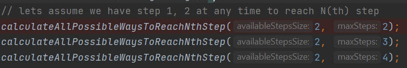

## java-stand-alone-programs

#### Project description
* ###### We have multiple stand-alone java programing solutions to various problems

---

    
PROGRAM 1 : All possible path to reach 'N(th) step' with a given steps

* All possible path to reach 'N(th) step' with a given steps : [SumOfStepsToMaxSteps.java](https://github.com/venkateswarlu-dhanala/java-stand-alone-programs/blob/develop/src/main/java/sdet/automation/nthstep/SumOfStepsToMaxSteps.java)
    ###### INPUT:
    
    ###### OUTPUT:
    

---
#### Running the project in local
* ###### Pre-requisites
    - java installed in your system [check with : 'java --version']

* ###### Run test locally with below steps
  * Clone the project to local - 'git clone https://github.com/venkateswarlu-dhanala/java-stand-alone-programs.git'
    * Run '[SumOfStepsToMaxSteps.java](https://github.com/venkateswarlu-dhanala/java-stand-alone-programs/blob/develop/src/main/java/sdet/automation/nthstep/SumOfStepsToMaxSteps.java)' as java program
  
#### ***Thank you for visiting and Happy learning - Venkateswarlu Dhanala***
